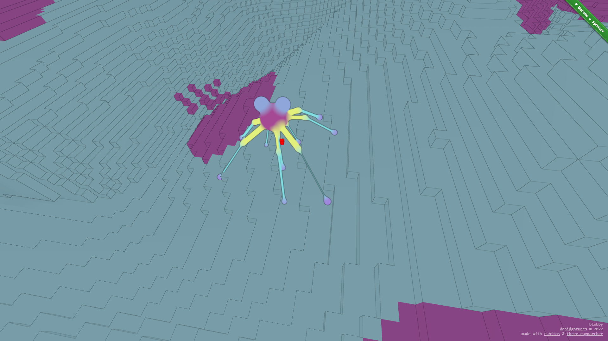

[blobby](https://github.com/danielesteban/blobby)
==

[](https://blobby.gatunes.com)

### Dev environment

```bash
# clone repo:
git clone --recursive https://github.com/danielesteban/blobby.git
cd blobby
# install dependencies:
npm install
# start environment:
npm start
# open http://localhost:8080/ in your browser
```
